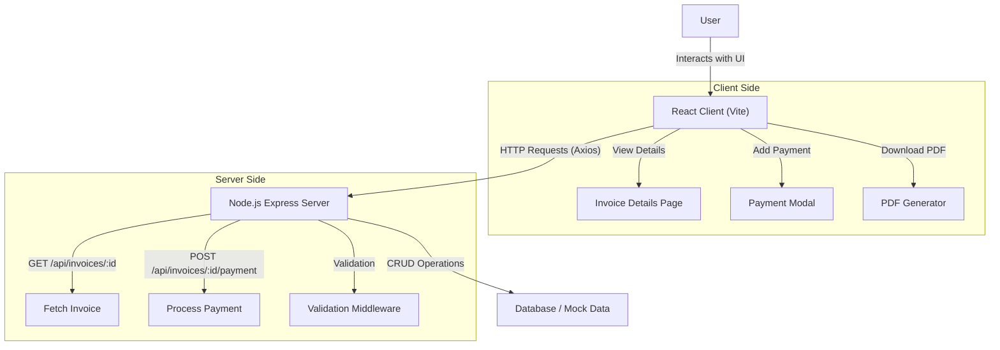

# Invoice Details Assignment - Meru Technosoft

This project is a full-stack MERN application developed as an assignment for Meru Technosoft Private Limited. It features a comprehensive Invoice Details page allowing users to view, manage, and process invoice data efficiently.

## Table of Contents
- [Project Overview](#project-overview)
- [Workflow Diagram](#workflow-diagram)
- [Tech Stack](#tech-stack)
- [Setup Instructions](#setup-instructions)
- [API Endpoints](#api-endpoints)
- [Folder Structure](#folder-structure)

## Project Overview
The application consists of a typically structured **React frontend** and a **Node.js/Express backend**. 

**Key Features:**
- **Invoice Management:** View detailed invoice information including line items and totals.
- **Payment Processing:** Add payments to specific invoices via a modal interface.
- **Status Tracking:** Automatically updates invoice status (e.g., Pending, Paid, Late) based on payments and due dates.
- **PDF Generation:** Download invoice details as a PDF document.

## Workflow Diagram



## Tech Stack
- **Frontend:** React 19, Vite, TailwindCSS, Lucide React (Icons), Axios
- **Backend:** Node.js, Express.js, CORS
- **Tools:** Git, npm

## Setup Instructions

### Prerequisites
- [Node.js](https://nodejs.org/) (v16 or higher recommended)
- [Git](https://git-scm.com/)

### 1. Clone the Repository
## Running the Application

Follow these steps to get the project up and running on your local machine.

### 1. Prerequisites
- **Node.js**: Ensure you have Node.js (v18+) installed.
- **Git**: Ensure you have Git installed to manage the repository.

### 2. Installation
First, clone the repository and install dependencies for both the client and server.

```bash
# Clone the repository
git clone https://github.com/ShreyashPatil530/Assignmet-For-Meru-Technosoft-Private-Limited.git
cd Assignmet-For-Meru-Technosoft-Private-Limited

# Install Server dependencies
cd server
npm install

# Install Client dependencies
cd ../client
npm install
```

### 3. Start the Backend (Server)
Navigate to the `server` folder and start the Node.js server.
```bash
cd server
npm start
```
- The server will be running at: `http://localhost:5000`

### 4. Start the Frontend (Client)
Open a **new terminal**, navigate to the `client` folder, and start the Vite development server.
```bash
cd client
npm run dev
```
- The client will be running at: `http://localhost:5173`
- Open this URL in your browser to view the Invoice Details page.

## API Endpoints
| Method | Endpoint | Description |
|---|---|---|
| `GET` | `/api/invoices/:id` | Fetch specific invoice details. |
| `POST` | `/api/invoices/:id/payments` | Add a payment record to a specific invoice. |

## Folder Structure
\`\`\`
root
├── client/          # Frontend React Application
│   ├── src/         # Source code (Components, Pages, Assets)
│   ├── public/      # Static assets
│   └── package.json # Frontend dependencies
├── server/          # Backend Node.js Application
│   ├── index.js     # Server entry point
│   ├── routes/      # API route definitions
│   └── package.json # Backend dependencies
└── README.md        # Project Documentation
\`\`\`
